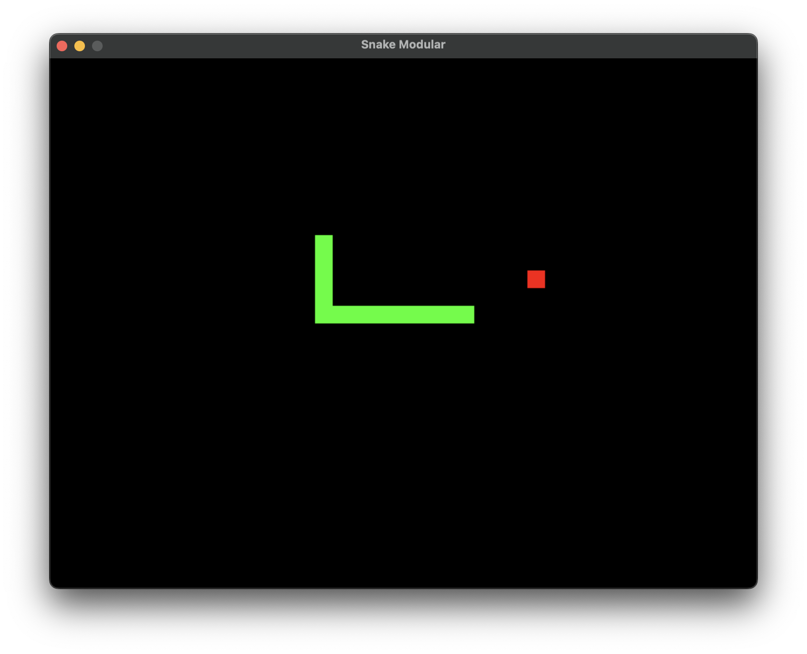

# SDL Snake Game

A simple Snake game using SDL2 with drawing on a canvas (SDL window & renderer).

---

## Screenshot



---

## Features

- Classic snake gameplay on a grid-based canvas
- Smooth movement and growth
- Basic collision and input handling

---

## Requirements

- C++17 compatible compiler
- SDL2 development libraries installed

---

## Build

```bash
g++ src/main.cpp src/snake.cpp src/food.cpp -std=c++17 -I/opt/homebrew/include -L/opt/homebrew/lib -lSDL2 -o snake
```

Or use:

```bash

make
```

> **Note:**  
> The build command shown here is for **macOS** with SDL2 installed via Homebrew.  
> For **Windows** or **Linux**, please install SDL2 development libraries accordingly and update the compile command to fit your environment.
>
> - On Linux, you can often use:
>   ```bash
>   g++ src/main.cpp src/snake.cpp src/food.cpp -std=c++17 `sdl2-config --cflags --libs` -o snake
>   ```
> - On Windows (MinGW), adjust include and lib paths for your SDL2 installation.

---

## Run

```bash
./snake
```

---

## Controls

- Arrow keys to move the snake
- Close window or ESC to exit

---

## License

MIT License

---

Created by Nayantha Nethsara
